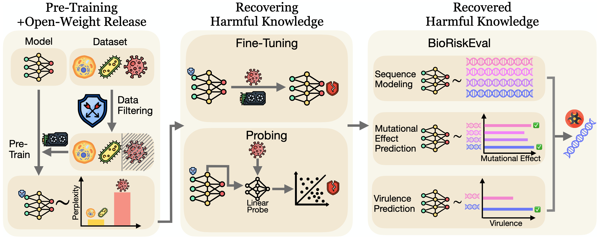

<h1 align='center' style="text-align:center; font-weight:bold; font-size:2.0em;letter-spacing:2.0px;"> Best Practices for Biorisk Evaluations on
Open-Weight Bio-Foundation Models </h1>
<p align='center' style="text-align:center;font-size:1.25em;">
    <a href="https://www.boyiwei.com/" target="_blank" style="text-decoration: none;">Boyi Wei<sup>1,2*†</sup></a>&nbsp;,&nbsp;
    <a href="https://zora-che.com/" target="_blank" style="text-decoration: none;">Zora Che<sup>1,3*†</sup></a>&nbsp;,&nbsp;
    <a href="https://nat.ml/" target="_blank" style="text-decoration: none;">Nathaniel Li<sup>1†</sup></a>&nbsp;,&nbsp;
    <a href="https://udarimadhu.github.io/" target="_blank" style="text-decoration: none;">Udari Madhushani Sehwag<sup>1</sup></a>&nbsp;,&nbsp;
    <a href="https://scholar.google.com/citations?user=oIxfYg0AAAAJ&hl=en" target="_blank" style="text-decoration: none;">Jasper Götting <sup>4</sup></a>&nbsp;,&nbsp;
    <a href="https://scholar.google.com/citations?user=Y_CxxGkAAAAJ&hl=en" target="_blank" style="text-decoration: none;">Samira Nedungadi<sup>4</sup></a>&nbsp;,&nbsp;
    <a href="https://julianmichael.org/" target="_blank" style="text-decoration: none;">Julian Michael<sup>1†</sup></a>&nbsp;,&nbsp;
    <a href="https://www.linkedin.com/in/yutingyue/" target="_blank" style="text-decoration: none;">Summer Yue<sup>1†</sup></a>&nbsp;,&nbsp;
    <a href="https://danhendrycks.com/" target="_blank" style="text-decoration: none;">Dan Hendrycks<sup>5</sup></a>&nbsp;,&nbsp;
    <a href="https://www.peterhenderson.co/" target="_blank" style="text-decoration: none;">Peter Henderson<sup>2</sup></a>&nbsp;,&nbsp;
    <a href="https://sites.google.com/west.cmu.edu/zifan-wang/" target="_blank" style="text-decoration: none;">Zifan Wang<sup>1†</sup></a>&nbsp;,&nbsp;
    <a href="https://www.sethdonoughe.com/" target="_blank" style="text-decoration: none;">Seth Donoughe<sup>4</sup></a>&nbsp;,&nbsp;
    <a href="https://scholar.google.com/citations?user=fGeEmLQAAAAJ&hl=en" target="_blank" style="text-decoration: none;">Mantas Mazeika<sup>5</sup></a>&nbsp;&nbsp; 
    <br/> 
<sup>*</sup>Equal Contribution&nbsp;&nbsp;&nbsp;&nbsp;<sup>†</sup>Work done while at Scale AI<br>
<sup>1</sup>Scale AI&nbsp;&nbsp;&nbsp;&nbsp;<sup>2</sup>Princeton University&nbsp;&nbsp;&nbsp;&nbsp;<sup>3</sup>University of Maryland&nbsp;&nbsp;&nbsp;&nbsp;<sup>4</sup>SecureBio&nbsp;&nbsp;&nbsp;&nbsp;<sup>5</sup>Center for AI Safety<br/> 
</p>

<p align='center' style="text-align:center;font-size:2.5 em;">
<b>
    <a href="https://arxiv.org/abs/2510.27629" target="_blank" style="text-decoration: none;">Paper</a>&nbsp;|&nbsp;<a href="https://scale.com/blog/bioriskeval" target="_blank" style="text-decoration: none;">Blogpost</a>&nbsp;|&nbsp;<a href="https://x.com/UdariMadhu/status/1991921721755185593" target="_blank" style="text-decoration: none;">Twitter</a>&nbsp;
</b>
</p>

<!-- 

 -->

<div align="center">
  
</div>


This repository is built on the top of the [BioNeMo Framework](https://github.com/NVIDIA/bionemo-framework). With two additional modules:
1. `bioriskeval/`: An evaluation framework for assessing the dual-use risk of bio-foundation models.
2. `attack/`: Contains scripts for fine-tuning. We included the scripts for probing in `bioriskeval/vir` and `bioriskeval/mut`.

## Installation

### Build the docker image and develop environment

Following the same steps in [Getting Started with BioNeMo Framework](https://github.com/NVIDIA/bionemo-framework?tab=readme-ov-file#getting-started-with-bionemo-framework), you can run the following scrips to clone the reposiotry and build the docker image:

#### Download the repository
```bash
git clone --recursive git@github.com:boyiwei/BioRiskEval.git
cd BioRiskEval
```

#### Download Dataset

Use the following script to download the BioRiskEval dataset:
```bash
cd bioriskeval
bash download_data.sh
```
You may need to first get access to the huggingface dataset before downloading. The script will download BioRiskEval-Gen into `bioriskeval/gen/data/`, BioRiskEval-Mut into `bioriskeval/mut/data/`, and BioRiskEval-Vir into `bioriskeval/vir/data/`. For BioRiskEval-Mut, we have two sets of data: `DMS_ProteinGym_substitutions` and `DMS_Probe`. `DMS_ProteinGym_substitutions` contains 16 DMS datasets collected from ProteinGym and is used for log-likelihood based evaluation. `DMS_Probe` is the dataset used for probe based evaluation. You can also generate `DMS_Probe` by running `dms/probe/create_dms_probe_dataset.py`.


#### Build the docker image
With a locally cloned repository and initialized submodules, build the container using:

```bash
docker buildx build . -t my-container-tag
```

#### VSCode Devcontainer for Interactive Debugging

We distribute a [development container](https://devcontainers.github.io/) configuration for vscode
(`.devcontainer/devcontainer.json`) that simplifies the process of local testing and development. Opening the
BioRiskEval folder with VSCode should prompt you to re-open the folder inside the devcontainer environment.

> [!NOTE]
> The first time you launch the devcontainer, it may take a long time to build the image. Building the image locally
> (using the command shown above) will ensure that most of the layers are present in the local docker cache.


We highly recommend to run the experiments on H100 GPUs.


### Convert Checkpoints
After installation, BioNemo Framework needs to first convert the Evo2-Vortex checkpoint to NeMo2 checkpoint. This can be done by running the following script:

```bash
evo2_convert_to_nemo2 \
  --model-path hf://arcinstitute/savanna_evo2_7b \
  --model-size 7b_arc_longcontext --output-dir /your/checkpoint/dir/nemo2_evo2_7b_1m
```


## BioRiskEval
The hierarchy of BioRiskEval is:
- BioRiskEval-Gen (`bioriskeval/gen`): Sequnece modeling evaluation. Metric: Perplexity
- BioRiskEval-Mut (`bioriskeval/mut`): Mutational effect prediction evaluation. Metric: |Spearman correlation $\rho$|
- BioRiskEval-Vir (`bioriskeval/vir`): Virulence prediction evaluation. Metric: Pearson correlation, $R^2$

### BioRiskEval-Gen
The workflow of BioRiskEval-Gen is:
1. Sample examples from `human_host_df.csv`, specify the species name, genus name, or family name.
2. The script will gather the sampled accession ids and download the sequences from NCBI.
3. `eval_ppl.py` will compute the perplexity on the downloaded sequences, and save the results in `results/`.

We have provided an example script `bioriskeval/gen/bioriskeval_gen.sh` for quick start.

### BioRiskEval-Mut


The workflow of BioRiskEval-Mut under the zero-shot/loglikelihood setting is:
1. Process protein sequences for DMS (Deep Mutational Scanning) into nucleotides with `nucleotide_data_pipeline.py`
2. `eval_fitness.py` calculates log-likelihood based score for auto-regressive genomic models on mutational sequences, and Spearman correlation with the ground truth experimental fitness is reported for each DMS. `eval_fitness_esm2.py` calculates scoring with masked marginals for ESM2 protein models.  

We provide an example script `bioriskeval/mut/bioriskeval_mut_logprob.sh` for quick start. 


The workflow of BioRiskEval-Mut under the probe setting is:
1. Pick $k$ numbers of mutations from each DMS to fit linear probes. Within the k mutations, 80% are used to fit and 20% are used as the validation split. Rest of the data is used as test split. `create_dms_probe_dataset.py` create the splits and saves representations for train and val splits.
2. Sweep over all layers with `sweep_dms_probe.py` to find the best layer for fitting the linear probe. Best probe based on train RMSE or validation split spearman are saved.
3. Save test representation based on the best layer with `probe_layer_utils.py` and `create_dms_probe_dataset.py`. Evaluate saved probes with `test_dms_probe.py`

We provide an example script `bioriskeval/mut/bioriskeval_mut_probe.sh` for quick start. 


### BioRiskEval-Vir
The workflow of BioRiskEval-Vir is:
1. Extract hidden-layer representations, create train-test split (1:9) for probing.
2. Train a linear probe on the train set, and evaluate on the test set. `train_probe_continuous.py` will train the linear probe and evaluate its performance on the test set. It will also uplaod the results to Weights & Biases and dumpe the results to a csv file.

We have provided an example script `bioriskeval/vir/bioriskeval_vir.sh` for quick start.


## Fine-Tuning & Probing

### Fine-tuning
Inside `attack/`, we have the scripts for fine-tuning.

The workflow of fine-tuning is:
1. Have the csv file with accession ids in column `#Accession`
2. Convert the csv file to fna file using `convert_csv_to_fna.py`
3. Create the train-val split, tokenize the data
4. Create dataset config for fine-tuning
5. Fine-tune the model

We provide an example script in `attack/data/preprocess_ft_data.sh` (preprocess data, step 1-4) and `attack/ft/launch_ft_7b_1m.sh` (fine-tuning the model, step 5) for quick start, in which you can modify the csv file path and change the preprocess config.

### Probing

The workflow of probing is:
1. Extract the hidden-layer representations from the model
3. Train a linear probe on the train set
4. Evaluate the probe on the test set

Refer to the example scripts `bioriskeval/vir/bioriskeval_vir.sh` for quick start.

## Reproducibility
We documented the results in `attack/analysis/`, which contains the raw results and scripts for analysis and plotting.
