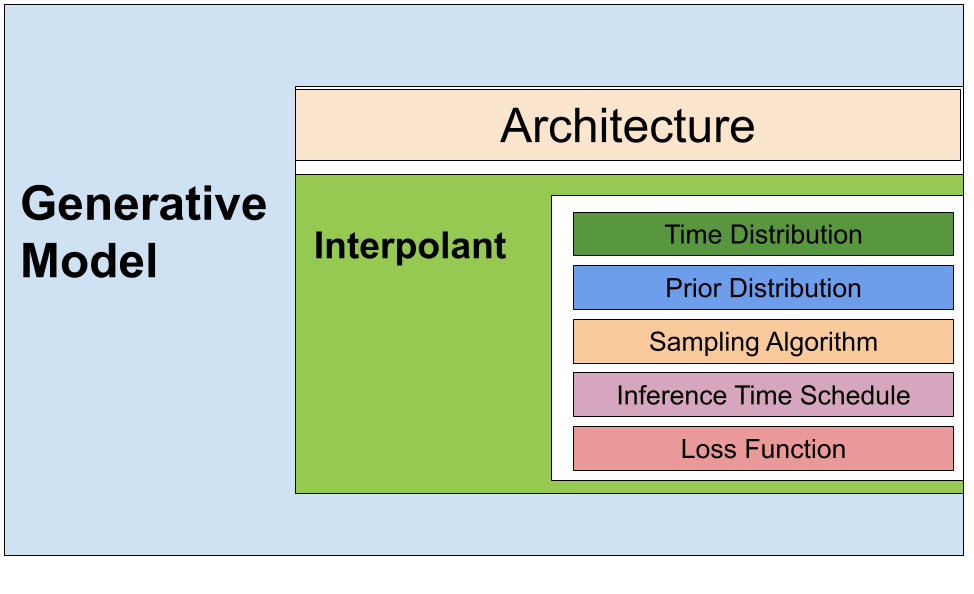

# Introducing BioNeMo Modular Co-Design

## $\text{\color{#76b900}{1. Overview}}$

Introducing BioNeMo Modular Codesign (MoCo), a versatile and extensible toolkit for building, training, and sampling from simulation-free generative models, specifically flow matching (FM) and diffusion models (DM) generally referred to as stochastic $\text{\color{#76b900}{interpolants}}$ ([Albergo et al.](https://arxiv.org/pdf/2303.08797)). MoCo is unified and tested for continuous and discrete data types, enabling seamless integration similar to your favorite PyTorch building blocks like `torch.nn.Linear`.

By abstracting away the complexities of the generative model theory, MoCo empowers researchers and developers to focus on high-level design decisions and architectural improvements. At the same time, its modular construction and customizable components facilitate easy extension and adaptation to emerging modeling techniques. MoCo's flexible and intuitive interface streamlines the process of creating, training, sampling from, and fine-tuning your generative models.

The development of MoCo was motivated by the widespread adoption of diffusion and flow matching techniques across various biological generative models, including protein design (folding, sequence generation, structure generation), molecule generation, and DNA and antibody design. Despite their popularity, a significant obstacle has been the rapid increase of custom and unique implementations, which can lead to inconsistencies in accuracy and reproducibility. Moreover, the lack of standardization makes it challenging to take algorithmic components from one model and adapt them to new applications, hindering the progress of research and innovation.

Inspired by the challenges in digital biology, $\text{\color{#76b900}{bionemo-moco}}$  provides a unified toolkit that can be easily integrated with any standard PyTorch representation, including graphs, images, text, and others outside the direct biological realm. While BioNeMo will leverage MoCo to accelerate advances in digital biology, MoCo’s versatility and modularity make it a valuable resource for any domain seeking to harness the power of generative models.

$\text{\color{#76b900}{bionemo-moco}}$ is available as part of the free, open-source NVIDIA BioNeMo framework, enabling researchers and developers to harness its full potential without restrictions. It can also be installed via `pip install bionemo-moco==0.0.1`. To jumpstart your work, MoCo's initial release includes built-in support for six popular generative interpolant-based frameworks, each with a variety of sampling algorithms:

#### Continuous Data

* Denoising Diffusion Probabilistic Models (DDPM)
* Conditional Flow Matching (CFM) (with various optimal transport strategies)
* Variational Diffusion Models (VDM)

#### Discrete Data

* Discrete Flow Matching (DFM)
* Masked discrete Diffusion Language Models (MDLM)
* Discrete Denoising Diffusion Probabilistic Models (D3PM)

## $\text{\color{#76b900}{2. What is an Interpolant?}}$

### High-Level Overview


<p style="text-align: center;">Figure 1: A high-level overview of the generative model process.</p>

An Interpolant controls how data is fed into a given neural network and how we use the network's outputs to generate things of interest. Compared to Large Language Models trained to fill in the masked token, Interpolant-based generative models like Diffusion and Flow Matching models operate by starting from random noise and iteratively transforming that into a meaningful sample that reflects the training data.

For our purposes, so long and the neural network architecture is set up to take in your desired data and output values of the same shape as the input data, the interpolant can control everything needed to yield a state-of-the-art generative model.

While there is a lot of literature in this space, we will provide a high-level theory, which is just enough to get you started.


### Quick Overview of Interpolant Theory
Given continuous data, we commonly use the standard normal distribution as our easy-to-access prior distribution. Our generative model aims to start from our simple prior and generate useful samples from the underlying data distribution.

Training such generative models, including diffusion and flow matching models, can be broken into two steps: (1) interpolation, (2) model estimation

#### Interpolation

The perturbation step starts by taking our input data $x_{\text{data}}$ from the data loader and mixing in noise from our prior distribution based on the sampled time $t$ from our time distribution. The amount of scaling and mixing is controlled by time-dependent forward process scalars $\lambda_f$, $\gamma_f$.

Depending on whether you are using Flow Matching or Diffusion, there are different choices in the time distribution and time dependent scalars. It is important to note that when using the Gaussian prior there exists choices in both that make FM and DM mathematically equivalent. For more details and rigorous derivations please refer to ([Diffusion Meets Flow Matching](https://diffusionflow.github.io/), and [Reidenbach et al.](https://openreview.net/pdf?id=9UoBuhVNh6))

The high level mathematical formula for this step can be represented as:

$$(1) \quad x_t = \lambda_f(t) x_{\text{data}} + \gamma_f(t) \epsilon \quad \text{where} \quad \epsilon \sim \mathcal{N}(0, I), \quad t \sim P_{\text{Time}}$$

We refer to Equation (1) as the interpolation step from Flow Matching context as we can linearly interpolate between our noise and data by setting $\lambda_f(t) = t$, $\gamma_f(t) = 1 - t$. We note that it is not a requirement for the scalars to sum to 1 and for the majority of Diffusion models the choice in the time dependent noise schedule is an important hyperparameter for model success.

Once we have our interpolated data $x_t$, we then feed that to our model for the second step of model estimation.

#### Model Estimation

$$(2) \quad A = M_{\theta}(x_t, t) \quad \text{where} \quad t \sim P_{\text{Time}}$$


The model estimation step covers the forward pass and loss calculation of standard machine learning model training.

Here we feed the model ($M_{\theta}$) in our interpolated data ($x_{t}$)and the time ($t$) value we used to interpolate the data with to produce an output $A$. What this output is depends on which interpolant being used and how you want to set up your problem.

For example for continuous diffusion interpolants we can have the model produces one of three different but connected representations illustrated in Salimans et al:

* Clean data prediction: given the noisy input, the model learns to remove the noise that was added at time $t$ and predict the clean data.
* Noise prediction: the model learns to predict the noise that was used at time $t$ to create $x_t$.
* Velocity prediction: a hybrid of the two, where we learn the velocity $\frac{1}{\gamma_f}(\lambda_f x_t - x_{\text{data}})$.

Similarly for Flow Matching it is common to see models directly predicting the velocity i.e. the vector field or the clean data.

All of these ways of designing the model output impact how we calculate our loss function, specifically how we weight the loss with respect to how we are interpolating our data. The choice in prediction type is up to you and in many cases can be made equivalent under the correct choices in loss scaling, time and noise distributions and schedulers. In practice we see certain applications prefer to use one over another and is decided based on the resulting benchmark performance.

[Diffusion Meets Flow Matching](https://diffusionflow.github.io/) goes into great detail about when to pick each scenario and how to pick your weighting function. We encourage you to check it out along with the original papers introducing the various interpolants for a more detailed walkthrough.

Once we produce $A$ in Equation 2, the next step is to compute the prediction error, which depends on the chosen representation (data, velocity, or noise). It is important to note that one can easily transform from one representation to another, as all three are grounded in the same interpolation shown in Equation 1. From there, the loss functions shown in Equation 3 can be viewed as a weighted mean squared error (MSE) loss to encourage our model to produce outputs close to the ground truth representation ($A^*$), such that we learn how to move between our prior and data distribution as a function of time.

$$(3) \quad L = \lambda_L(t)\left\|A^* - M_{\theta}(x_t, t)\right\|^2$$

If you are familiar with one of the original diffusion models DDPM the loss equals the MSE of the predicted noise and true noise with a weight equal to one.

In summary training a generative model equations to the below pseudo code:
```python
prediction_type = Literal[PredictionType.NOISE, PredictionType.DATA, PredictionType.VELOCITY]

interpolant = Interpolant(..., prediction_type)

for epoch in range(num_epochs):
    for x1 in dataloader:
        optimizer.zero_grad()
        x0 = interpolant.sample_prior(x1.shape)
        t = interpolant.sample_time(batch_size)

        # Step 1 Interpolation
        xt = interpolant.interpolate(x1, t, x0)

        # Step 2 Model Evaluation
        A = model(xt, t)

        if interpolant.prediction_type == PredictionType.NOISE:
            loss = interpolant.loss(A, x0, t).mean()
        elif interpolant.prediction_type == PredictionType.DATA:
            loss = interpolant.loss(A, x1, t).mean()
        elif interpolant.prediction_type == PredictionType.VELOCITY:
            loss = interpolant.loss(A, interpolant.calculate_velocity(x1, t, x0), t).mean()

        loss.backward()
        optimizer.step()
```
Here we see that based on how you initialize the interpolant the underlying architecture learns to predict the noise, data, or velocity.

#### Generation

Any way you want to view the training process i.e. learning to predict the noise or learning how to predict the clean sample from noisy inputs, the end result of a well trained model is the ability to navigate the path from the simple prior to the desired data distribution.

Now in order to generate samples from the model we iteratively query the model starting from a sample from our prior distribution and update our sample as a function of time.

$$(4) \quad x_{t+1} = \lambda_r(t)x_t + \psi_r(t)M_{\theta}(x_t, t) + \gamma_r(t) \epsilon, \quad \text{where } \epsilon \sim \mathcal{N}(0, I)$$

Equation 4 illustrates a general update step, where, based on three time-dependent scalars, we determine how much of the running prediction $x_t$ we want to preserve in this reverse process ($\lambda_r(t)$), how much of the module output $M_{\theta}(x_t, t)$ we want to incorporate ($\psi_r(t)$), and how much noise $\epsilon$ we want to add, if any ($\gamma_r(t)$). We write it in this manner as all interpolants integrate from the prior $x_0$ to data $x_1$, but can do so in various ways, including simulating an ordinary or stochastic differential equation (ODE and SDE). We highly recommend [Diffusion Meets Flow Matching](https://diffusionflow.github.io/) for a rigorous derivation behind the connection to differential equations and how to solve them.

For our purposes we want to paint a general picture that for every interpolant there are many ways of sampling from them. Some utilize noise to improve quality whereas others find a deterministic way to accelerate the sampling process reducing the number of integration or update steps.

In pseudo code this is what sampling from a trained model looks like:
```python
sample = interpolant.sample_prior(data.shape)  # Start with noise
schedule = InferenceSchedule()
for t in schedule:
    A = model(sample, t)
    sample = interpolant.step(A, sample, t)
return sample
```

### How easy is $\text{\color{#76b900}{bionemo-moco}}$  to use?
As we have shown it is relatively simple to think of a Diffusion model as the underlying architecture along with an interpolant controlling the input and output manipulations.

We have built $\text{\color{#76b900}{  bionemo-moco}}$ around this abstraction to make integration with custom models on any data as easy as possible.

Below is a snippet taken from our continuous interpolant example. Here we see that if you can provide a dataloader and architecture, MoCo provides the two steps for training as well as the update step function to generate samples.

So long as you can think of your problem as either data or noise prediction, you are able to build fully customizable generative models with only a few lines of code.

To see this example in action, see our [Continuous Data Interpolant Tutorial](./examples/continuous_data_interpolant_tutorial.ipynb) in the `bionemo-moco` examples directory.

```python
from bionemo.moco.interpolants import ContinuousFlowMatcher
from bionemo.moco.distributions.time import UniformTimeDistribution
from bionemo.moco.distributions.prior import GaussianPrior
from bionemo.moco.schedules.inference_time_schedules import LinearInferenceSchedule

uniform_time = UniformTimeDistribution()
simple_prior = GaussianPrior()
cfm = ContinuousFlowMatcher(time_distribution=uniform_time,
                            prior_distribution=simple_prior,
                            prediction_type="velocity")

# Place both the model and the interpolant on the same device
DEVICE = "cuda"
model = model.to(DEVICE)
cfm = cfm.to_device(DEVICE)

for k in range(20000):
    optimizer.zero_grad()
    shape = (batch_size, dim)
    x0 = cfm.sample_prior(shape).to(DEVICE)
    x1 = sample_moons(batch_size).to(DEVICE)  # data loader sample
    t = cfm.sample_time(batch_size)
    xt = cfm.interpolate(x1, t, x0)
    ut = cfm.calculate_target(x1, x0)
    vt = model(torch.cat([xt, t[:, None]], dim=-1))
    loss = cfm.loss(vt, ut, target_type="velocity").mean()
    loss.backward()
    optimizer.step()

inf_size = 1024 # number of points to sample
inference_sched = LinearInferenceSchedule(nsteps=100, device=DEVICE)
schedule = inference_sched.generate_schedule()
dts = inference_sched.discretize()
sample = cfm.sample_prior((inf_size, 2)).to(DEVICE)  # Start with noise
trajectory = [sample]
for dt, t in zip(dts, schedule):
    full_t = inference_sched.pad_time(inf_size, t, DEVICE)
    vt = model(torch.cat([sample, full_t[:, None]], dim=-1))
    sample = cfm.step(vt, sample, dt, full_t)
    trajectory.append(sample)
return sample
```

Note as each interpolant has several available step functions to choose from with different parameters. All can be accessed via a general_step() syntax shown below.

The first argument is the name of the step function you would like to use. The second is a dictionary of key value pairs of the desired arguments.

```python
ddpm.general_step("step_ddim", {"model_out": model_output, "t": time, "xt": x_t})

cfm.general_step("step_score_stochastic", {"model_out": model_out, "xt": xt, "dt": dt, "t": time})
```

### Why would you want to use $\text{\color{#76b900}{bionemo-moco}}$?

#### New to building generative modeling

If you have recently begun exploring how to build generative models, $\text{\color{#76b900}{  bionemo-moco}}$ serves as an easy to use abstraction to enable quick prototyping and fast learning. While it helps to know exactly what is going on in your model, it may be useful to have a light weight and tested toolkit to quickly get you started. $\text{\color{#76b900}{  bionemo-moco}}$ is designed to accelerate the ease of use for generative model training and inference.  

#### Looking to improve generative models from an architecture perspective

One major benefit of using MoCo is that it takes care of the "generative" part (i.e. interpolant, objective, sampling etc.) so you can focus more on neural network architectures innovations.

#### Generative modeling expert but want to try out new sampling algorithms

If you have been working with generative models you have probably had to convert equations from a recent paper into code to try out for your model. While not impossible, in many cases the original code base is not as well documented as you may like or may not even be public. With <span class="bionemo-color ">  bionemo-moco}}$ we have enabled desirable sampling functions like DDIM, various low temperature SDE solvers, and discrete sampling algorithms all accessible from a simple API. We emphasize that you do not even have to train your model with <span class="bionemo-color ">  bionemo-moco}}$ to do this as we show later in Use Case #3. In many cases these new sampling algorithms can be quite useful and come at no additional cost as shown in Use Case #1.

#### Theoretical Researcher working on new Diffusion, Flow Matching, or other generative modeling frameworks.

If you are more interested in building a new framework of generative models, $\text{\color{#76b900}{bionemo-moco}}$  gives an easy to use API with seamless integration into the bionemo-fw community. Furthermore your new framework can be quickly merged and made accessible to all $\text{\color{#76b900}{ bionemo-moco}}$ users. This fast dispersion and sharing of information is what we are excited about and will work to continually update $\text{\color{#76b900}{ bionemo-moco}}$ with the latest and greatest algorithms. We encourage you to build your new algorithms in $\text{\color{#76b900}{ bionemo-moco}}$ to facilitate better reproducibility and reusability as your new interpolant may prove quite useful for generative tasks you may have not initially set out to improve.


## $\text{\color{#76b900}{ 3. Three Real Use Cases}}$

Below we provide three examples of how $\text{\color{#76b900}{bionemo-moco}}$ can be used
* The impact of training the same architecture with a new interpolant.
* The impact of combining multiple interpolants together.
* The impact of taking an off-the-shelf model and integrating MoCo to facilitate generation.

### A. Swapping out the Interpolant for structure-based protein backbone generation.

Here we take Genie2 ([Lin et al.](https://arxiv.org/abs/2405.15489)), a protein generative model and take its architecture and training data and train it with Conditional Flow Matching with velocity prediction. We then sample from it using low temperature sampling by first converting the predicted vector field to the score function to use it similar to prior Diffusion model inference. Details for this are found in [Geffner et al.](https://openreview.net/forum?id=TVQLu34bdw&noteId=ypeoraSUA0)

By taking the existing architecture and swapping the existing DDPM to $\text{\color{#76b900}{bionemo-moco's}}$ Continuous Flow Matching interpolants we see improvements in the generative quality as well as the ability to reduce the number of steps by 2.5x when using its stochastic score sampling step function.

**Table 1: Genie2 Ablations: de novo generation of 500 protein backbones**
| **Protein Benchmarks** | **Original DDPM noise prediction** | **Switch to MoCo Continuous Flow Matching with stochastic score sampling** |
| --- | --- | --- |
| **Designability (↑)** | 95.2% | 97.0% |
| **Diversity (↑)** | 56.2% | 71.0% |
| **Disimilarity (1 - Novelty) (↑)** | 37% | 38.2% |
| **Number of steps (↓)** | 1000 | 400 |

This change (training and inference) is possible **in roughly 15 lines of code** after removing all hardcoded DDPM aspects from the public codebase.

### B. Combining multiple interpolants for improved generative quality.

Rather than just working with a single interpolant for a single variable. Several interpolants can be combined to build a multivariate generative model. [Reidenbach et al.](https://openreview.net/pdf?id=9UoBuhVNh6) explore this with the creation of Megalodon and Megalodon-flow to simultaneously generate molecule structure and discrete atom types and bond types.

**Table 2: Measuring Unconditional Molecule Generation: 2D topological and 3D distributional benchmarks (bond angle and dihedral).**


| Model | Steps | Atom Stab. ($\uparrow$) | Mol Stab. ($\uparrow$) | Connected Validity ($\uparrow$) | Bond Angle ($\downarrow$) | Dihedral ($\downarrow$) |
| --- | --- | --- | --- | --- | --- | --- |
| Diffusion Models | - | - | - | - | - | - |
| EQGAT-diff$^{x0}_{disc}$ | 100 | 0.996 | 0.891 | 0.768 | 1.772 | 3.514 |
| EQGAT-diff$^{x0}_{disc}$ | 500 | 0.998 | 0.935 | 0.830 | 0.858 | 2.860 |
| Megalodon-small | 500 | 0.998 | 0.961 | 0.900 | 0.689 | 2.383 |
| Megalodon | 100 | 0.998 | 0.939 | 0.817 | 0.871 | 3.367 |
| Megalodon | 500 | **0.999** | 0.977 | 0.927 | **0.461** | **1.231** |
| Flow Matching Models | - | - | - | - | - | - |
| SemlaFlow | 20 | 0.997 | 0.962 | 0.875 | 2.188 | 3.173 |
| SemlaFlow | 100 | 0.998 | 0.979 | 0.920 | 1.274 | 1.934 |
| Megalodon-flow | 20 | 0.996 | 0.964 | 0.886 | 1.892 | 3.184 |
| Megalodon-flow | 100 | 0.997 | **0.990** | **0.948** | 0.976 | 2.085 |

Here we present Megalodon trained with continuous and discrete diffusion and a flow matching counterpart denoted as Megalodon-flow. The task is to simultaneously generate (1) a molecule's 3D structure, (2) discrete atom types for each atom, and the location and (3) discrete type of chemical bonds leveraging 3 independent interpolants. Prior methods EQGAT-diff and SemlaFlow use the same underlying respective interpolants as both Megalodon variants, yielding a fair comparison solely of the architecture across different generative frameworks.

In other words we see that use of flow matching vs diffusion gives specific benefits like better 2D validity vs 3D structural accuracy. We also see that regardless of choice in generative framework, Megalodon obtains the best results.

**Table 3: xTB Relaxation Error: Length Å, angles degrees, energy kcal/mol**

| Model |   Bond Length | Bond Angles | Dihedral | Median Δ E_relax | Mean Δ E_relax |
| ---   |  ---        | ---        | ---     | ---          | ---          |
| **Training Data** |  0.0000     | 0.00     | 7.2e-3  | 0.00       | 1.0e-3      |
| Diffusion Models   |      -    |     -    |  -    |      -     |     -      |
| **EQGAT-diff** |   0.0076     | 0.95     | 7.98    | 6.36       | 11.06       |
| **Megalodon-small** |   0.0085     | 0.88     | 7.28    | 5.78       | 9.74        |
| **Megalodon** |   **0.0061**  | **0.66**  | **5.42** | **3.17**   | **5.71**    |
| Flow Matching Models   |   -       |    -     |  -   |      -    |    -       |
| **SemlaFlow** |   0.0309     | 2.03     | 6.01    | 32.96      | 93.13       |
| **Megalodon-flow** |   **0.0225** | **1.59** | **5.49** | **20.86**  | **46.86**   |

In Table 2, we see that with the flow matching interpolants we get better 2D topological stability and validity and can even do so as low as 20 inference steps. This comes at a cost of poor molecular energy as shown in Table 3. As a result if you care about being able to quickly produce reasonable molecules you may want to use the flow matching variant whereas if you care more about the energy of the generated molecules the diffusion variant is roughly one order of magnitude more accurate.

The work with Megalodon demonstrates that the architecture development can be easily separated from the design of the interpolant and general generative modeling framework.


### C. Integrating $\text{\color{#76b900}{ bionemo-moco}}$ into off the shelf models to leverage new sampling functions

**Table 3: GenMol Sampling Ablations for de novo molecule generation**
| Sampling Method | # of steps (↓) | Time sec (↓) | Validity % (↑) | Unique % (↑) | Diversity % (↑) | Synthesizable (% SA <= 4) (↑) | Drug-Like (% QED >= 0.6) (↑) | Pass Rate** (↑) |
| --- | --- | --- | --- | --- | --- | --- | --- | --- |
| step | 20 | 21 | 93.6 | 97.9 | 91.2 | 68.6 | 54.1 | 41.5 |
| step | 75 | 74 | 97.1 | 98.8 | 90.0 | 74.1 | 64.0 | 51.7 |
| step | 100 | 97 | 97.4 | 99.5 | 89.7 | 73.7 | 69.2 | 54.8 |
| step (temperature=0.6) | 20 | 21 | 95.2 | 98.5 | 88.9 | 75.9 | 68.4 | 56.8 |
| step (temperature=0.6)| 100 | 97 | 99.2 | 99.9 | 87.0 | 83.9 | 82.6 | 71.8 |
| step_confidence | 20 | 21 | 66.2 | 18.1 | 92.0 | 9.5 | 0.2 | 0.2 |
| step_confidence | 75 | 74 | 99.9 | 99.9 | 81.4 | 87.9 | 94.8 | 84.2 |
| step_self_path_planning| 100 | 95 | 99.8 | 99.8 | 83.2 | 89.2 | 95.1 | 85.3 |

Table 3 benchmarks a pretrained GenMol model from [Lee et al.](https://arxiv.org/abs/2501.06158) with various sampling algorithms including self path planning sampling introduced in [Peng et al.](https://arxiv.org/html/2502.03540v1).
Here we experiement with the default MDLM step function, low temperature sampling, fixed length confidence sampling and self path planning sampling.

It is important to note that this model was not trained with $\text{\color{#76b900}{ bionemo-moco}}$ but we integrate with the pretrained weights to leverage different sampling functions. This serves as an example in how to integrate $\text{\color{#76b900}{ bionemo-moco}}$ into your model at inference time without access to the training code (although we suggest also taking advantage of the training utilities too :) if you can).

## $\text{\color{#76b900}{ 4. Integrating bionemo-moco into your codebase}}$

To integrate Bionemo-Moco into your codebase, please ensure you meet the following requirements:

### Requirements

* `torch>=2.2`
* `numpy>=1.24.4,<2`
* `jaxtyping>=0.2.34`
* `pot>=0.9.5`
* `scikit-learn>=1.6.0`
* `matplotlib>=3.3.2`

### Example Code

Below is an example of how to integrate $\text{\color{#76b900}{bionemo-moco}}$ into your codebase. This example creates a wrapper around the existing GenMol model to access the underlying HuggingFace `BertForMaskedLM` and add the $\text{\color{#76b900}{bionemo-moco}}$ MDLM interpolant on top.
```python
from bionemo.moco.distributions.prior import DiscreteMaskedPrior
from bionemo.moco.interpolants import MDLM
from bionemo.moco.distributions.time import UniformTimeDistribution
from bionemo.moco.schedules.noise.continuous_noise_transforms import LogLinearExpNoiseTransform
from bionemo.moco.schedules.inference_time_schedules import LinearInferenceSchedule

class ExampleMoCoMDLMforMoleculeGeneration:
    def __init__(self, path):
        self.model = BertForMaskedLM.load_from_checkpoint(path)
        self.model.eval()

        # Introduce MoCo
        prior = DiscreteMaskedPrior(num_classes=self.model.tokenizer.vocab_size,
                                    mask_dim=self.model.mask_index)
        time_distribution = UniformTimeDistribution(discrete_time=False)
        noise_schedule = LogLinearExpNoiseTransform()
        self.mdlm = MDLM(time_distribution=time_distribution,
                         prior_distribution=prior,
                         noise_schedule=noise_schedule)
        self.inference_time_schedule = LinearInferenceSchedule(direction="diffusion",
                                                             nsteps=100)

```
We add ```self.mdlm``` on top of a model itself so all we need is just the ability to produce logits.

```python
def de_novo_generation_mdlm_conf(self, num_samples=1, softmax_temp=0.5, randomness=0.5):
       x = torch.hstack([torch.full((1, 1), self.model.bos_index),
                         torch.full((1, 1), self.model.eos_index)])
       x = self._insert_mask(x, num_samples, min_add_len=40)
       x = x.to(self.model.device)
       self.mdlm.to_device(self.model.device)
       num_steps = (x == self.model.mask_index).sum(dim=-1).max().item()
       attention_mask = x != self.pad_index
       for i in range(num_steps):
           logits = self.model(x, attention_mask)
           x = self.mdlm.step_confidence(logits, x, i, num_steps, softmax_temp, randomness)

       # decode to SAFE strings
       samples = self.model.tokenizer.batch_decode(x, skip_special_tokens=True)
       # convert to SMILES strings
       # remove None and take the largest
      return samples

   def de_novo_generation_mdlm(self, num_samples=1, temperature=1.0):
       x = torch.hstack([torch.full((1, 1), self.model.bos_index),
                         torch.full((1, 1), self.model.eos_index)])
       x = self._insert_mask(x, num_samples, min_add_len=40)
       x = x.to(self.model.device)
       self.mdlm.to_device(self.model.device)
       DEVICE = self.model.device
       attention_mask = x != self.pad_index

       ts = self.inference_time_schedule.generate_schedule(device=DEVICE)
       dts = self.inference_time_schedule.discretize(device=DEVICE)
       for t, dt in zip(ts, dts):
           logits = self.model(x, attention_mask)
           x = self.mdlm.step(logits, t, x, dt, temperature = temperature)

       # decode to SAFE strings
       samples = self.model.tokenizer.batch_decode(x, skip_special_tokens=True)
       # convert to SMILES strings
       # remove None and take the largest
       return samples
```
